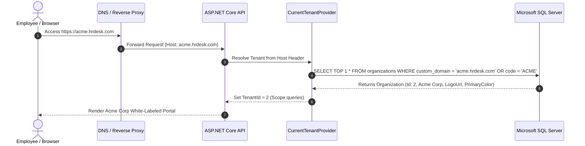

# 🌐 HRDesk — White-Label Branding & Custom Domain Guide

This document is the official technical and business guide on how to configure and manage **White-Label Branding, Custom Subdomains, and Custom Domains** in HRDesk.

---

## 📑 Table of Contents
1. [Business Value & Use Cases](#1-business-value--use-cases)
2. [How to Configure in the App (Step-by-Step)](#2-how-to-configure-in-the-app-step-by-step)
3. [DNS & IT Setup for Enterprise Custom Domains](#3-dns--it-setup-for-enterprise-custom-domains)
4. [Technical Architecture & Automatic Tenant Resolution](#4-technical-architecture--automatic-tenant-resolution)
5. [API Reference](#5-api-reference)

---

## 1. Business Value & Use Cases

### Why Enterprise Clients Need This:
- **Corporate Identity**: Enterprise clients (50+ to 1,000+ employees) prefer their staff to log into a branded company portal (`hrms.acmecorp.com`) rather than a generic third-party website.
- **Zero Confusion on Login**: When employees open their company subdomain (`acme.hrdesk.com`), the login page automatically loads their company name and logo without requiring them to enter a company code or select an organization from a list.
- **SaaS Monetization**: White-labeling and custom domains are high-tier features typically sold under the **Growth Enterprise** and **Enterprise Custom** subscription plans.

---

## 2. How to Configure in the App (Step-by-Step)

### Step 1: Open Organization Details
1. Log into your HRDesk account with an **Admin** or **SuperAdmin** profile.
2. Navigate to: **Settings → Organizations**.
3. Click on the target organization card or navigate to:
   ```text
   http://localhost:5173/settings/organizations/{organization_public_id}
   ```

### Step 2: Upload Company Logo
1. Under the **Company Logo & White-Label Branding** section, click **"Upload Image File"**.
2. Select any **PNG, JPG, SVG, or WEBP** image from your computer (max size: 5MB).
3. The image will instantly preview in the avatar box and upload to the server.
4. *Tip*: High-resolution transparent PNG or vector SVG logos provide the cleanest look across both light and dark themes.

### Step 3: Choose Primary Brand Accent Color
1. Select one of the preset brand swatches:
   - 🟡 **Warm Amber Gold** (`#D97706`)
   - 🔵 **Royal Blue** (`#2563EB`)
   - 🟢 **Emerald Teal** (`#059669`)
   - 🔴 **Crimson Red** (`#DC2626`)
   - 🟣 **Purple Indigo** (`#7C3AED`)
   - ⚫ **Slate Graphite** (`#334155`)
2. Or use the color picker / hex text box to input your company's exact brand hex code (e.g. `#0052CC`).
3. *How it works*: HRDesk dynamically updates CSS variables (`--gold-500` and `--gold-600`) so buttons, badges, active tabs, and focus rings match your brand in real time.

### Step 4: Set Custom Subdomain or Domain
1. In the **Custom Subdomain / Domain** field, enter your assigned workspace subdomain or custom domain:
   - Example Subdomain: `acme.hrdesk.com`
   - Example Custom Domain: `hrms.acmecorp.com` or `people.mycompany.in`
2. Click **"Save Organization"** at the bottom of the page.

---

## 3. DNS & IT Setup for Enterprise Custom Domains

When a client wants to point their own company domain (e.g. `hrms.acmecorp.com`) to HRDesk:

### DNS CNAME Record Configuration:
The client's IT administrator must add a **CNAME** DNS record with their DNS provider (Cloudflare, GoDaddy, Route53, Namecheap):

| Type | Host / Name | Target / Points To | TTL |
| :--- | :--- | :--- | :--- |
| **CNAME** | `hrms` (or `people`) | `app.hrdesk.com` (your main domain) | Auto / 300s |

### SSL / HTTPS Certificates:
- If using **Cloudflare**: Set SSL mode to *Full (Strict)*. Cloudflare handles automatic SSL certificates for subdomains.
- If using **Nginx Reverse Proxy / Caddy / Let's Encrypt**: The reverse proxy automatically provisions TLS certificates via ACME for configured incoming hostnames.

---

## 4. Technical Architecture & Automatic Tenant Resolution



### Key Source Files:
- **Tenant Host Resolver**: [`HRDesk.Web/Services/Infrastructure/CurrentTenantProvider.cs`](file:///c:/Users/Admin/HRDesk/HRDesk.Web/Services/Infrastructure/CurrentTenantProvider.cs)
  - Inspects incoming `HttpContext.Request.Host` to extract subdomains (`acme.hrdesk.com` $\rightarrow$ `acme`) or match against `organizations.custom_domain`.
- **Database Model**: [`HRDesk.Web/Models/Entities/Organization.cs`](file:///c:/Users/Admin/HRDesk/HRDesk.Web/Models/Entities/Organization.cs)
  - Stores `LogoUrl`, `PrimaryColor`, and `CustomDomain`.
- **Frontend Theme Injector**: [`client/src/context/CompanyContext.tsx`](file:///c:/Users/Admin/HRDesk/client/src/context/CompanyContext.tsx)
  - Injects `primaryColor` directly into `document.documentElement.style.setProperty('--gold-500', color)`.
- **Logo Storage Directory**: `HRDesk.Web/wwwroot/uploads/logos/`
  - Statically served via `app.UseStaticFiles()`.

---

## 5. API Reference

### 1. Upload Organization Logo
```http
POST /api/masters/organizations/{publicId}/logo
Content-Type: multipart/form-data
Authorization: Bearer <jwt_token>

[file: image binary (PNG, JPG, SVG, WEBP)]
```
**Response (200 OK):**
```json
{
  "message": "Logo uploaded successfully.",
  "logoUrl": "/uploads/logos/org_2_a1b2c3d4e5f6.png"
}
```

### 2. Update Organization Details & Branding
```http
PUT /api/masters/organizations/{publicId}
Content-Type: application/json
Authorization: Bearer <jwt_token>

{
  "name": "Acme Builders Corp",
  "code": "ACME",
  "address": "Ring Road, Surat, Gujarat",
  "logoUrl": "/uploads/logos/org_2_a1b2c3d4e5f6.png",
  "primaryColor": "#059669",
  "customDomain": "hrms.acmecorp.com",
  "isActive": true
}
```
**Response (200 OK):**
```json
{
  "message": "Organization updated successfully.",
  "id": 2,
  "publicId": "c1b00971-aaea-461a-af82-4a76e3ce143f"
}
```
